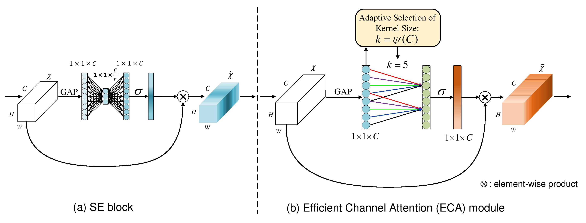
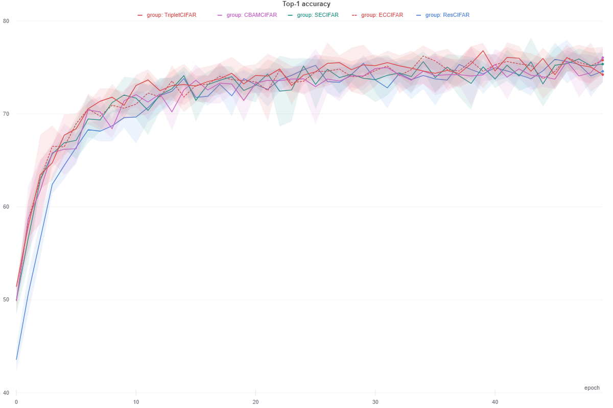
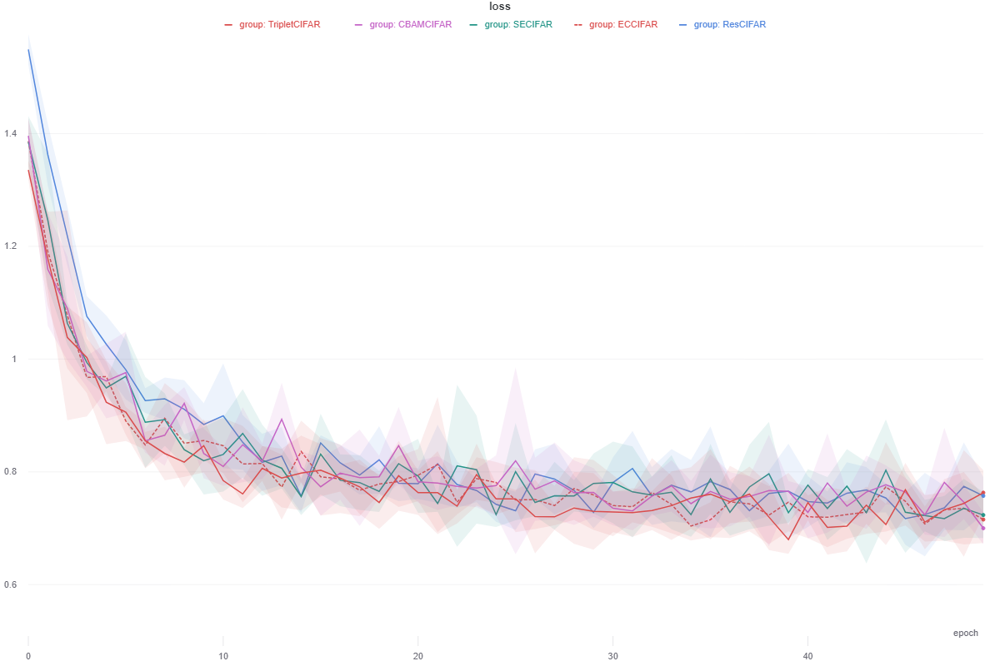
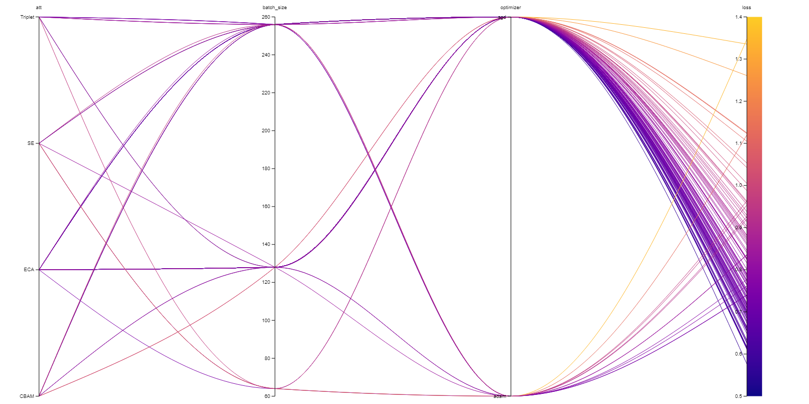
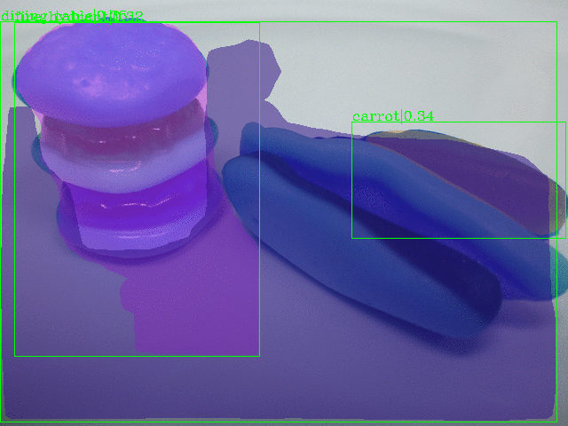

<h1 align="center">Efficient Channel Attention:<br>Reproducibility Challenge 2020</h1>
<p align="center">CVPR 2020 <a href="https://openaccess.thecvf.com/content_CVPR_2020/html/Wang_ECA-Net_Efficient_Channel_Attention_for_Deep_Convolutional_Neural_Networks_CVPR_2020_paper.html" target="_blank">(Official Paper)</a></p>

<p align="center">
    
    <a href="http://hits.dwyl.com/digantamisra98/Reproducibilty-Challenge-ECANET" alt="HitCount">
        </a>
    <a href="https://arxiv.org/abs/1910.03151" alt="ArXiv">
        </a>
    <a href="https://openaccess.thecvf.com/content_CVPR_2020/html/Wang_ECA-Net_Efficient_Channel_Attention_for_Deep_Convolutional_Neural_Networks_CVPR_2020_paper.html"                     alt="CVF">
          </a>
    <a href="https://openaccess.thecvf.com/content_CVPR_2020/papers/Wang_ECA-Net_Efficient_Channel_Attention_for_Deep_Convolutional_Neural_Networks_CVPR_2020_paper.pdf"                        alt="PDF">
          </a>
    <a href="https://openaccess.thecvf.com/content_CVPR_2020/supplemental/Wang_ECA-Net_Efficient_Channel_CVPR_2020_supplemental.pdf" alt="Supp">
          </a>
    <a href="https://www.youtube.com/watch?v=ipZ2AS1b0rI" alt="Video">
          </a>
    <a href="https://mybinder.org/v2/gh/digantamisra98/Reproducibilty-Challenge-ECANET/HEAD" alt="ArXiv">
        </a>
    <a href="https://twitter.com/DigantaMisra1" alt="Twitter">
          </a>
    <a href="https://wandb.ai/diganta/ECANet-sweep?workspace=user-diganta" alt="Dashboard">
        </a>
    <a href="https://wandb.ai/diganta/ECANet-sweep/reports/ECA-Net-Efficient-Channel-Attention-for-Deep-Convolutional-Neural-Networks-NeurIPS-Reproducibility-Challenge-2020--VmlldzozODU0NTM" alt="RC2020">
        </a>
    <a href="https://wandb.ai/diganta/ECANet-sweep/reports/Efficient-Channel-Attention--VmlldzozNzgwOTE" alt="Report">
        </a>
    <a href="https://colab.research.google.com/drive/1PHG4u_mkOnbge4RIzPjtfda1N-oiaDKI?usp=sharing" alt="Colab">
        </a>
    <a href="https://github.com/BangguWu/ECANet" alt="Report">
        </a>
</p>

<p align="center">
    
    </br>
    <em>Bounding Box and Segmentation Maps of ECANet-50-Mask-RCNN using samples from the test set of MS-COCO 2017 dataset.</em>
</p>

# Introduction

<p float="center">
    
    <br>
    <em>Structural comparison of SE and ECA attention mechanism.</em>
</p>

Efficient Channel Attention (ECA) is a simple efficient extension of the popular Squeeze-and-Excitation Attention Mechanism, which is based on the foundation concept of Local Cross Channel Interaction (CCI). Instead of using fully-connected layers with reduction ratio bottleneck as in the case of SENets, ECANet uses an adaptive shared (across channels) 1D convolution kernel on the downsampled GAP *C* x 1 x 1 tensor. ECA is an equivalently plug and play module similar to SE attention mechanism and can be added anywhere in the blocks of a deep convolutional neural networks. Because of the shared 1D kernel, the parameter overhead and FLOPs cost added by ECA is significantly lower than that of SENets while achieving similar or superior performance owing to it's capabilities of constructing adaptive kernels. This work was accepted at the IEEE/CVF Conference on Computer Vision and Pattern Recognition (CVPR), 2020. 

## How to run:

#### Install Dependencies:

```
pip install -r requirements.txt
```

This reproduction is build on PyTorch and MMDetection. Ensure you have CUDA Toolkit > 10.1 installed. For more details regarding installation of MMDetection, please visit this [resources page](https://mmdetection.readthedocs.io/en/latest/get_started.html#installation).

If ```pip install mmcv-full``` takes a lot of time or fails, use the following line (customize the torch and cuda versions as per your requirements):
```
!pip install mmcv-full==latest+torch1.7.0+cu101 -f https://download.openmmlab.com/mmcv/dist/index.html
```

Although [Echo] can be installed pip, the features we currently use in this project aren't available in the latest pip version. So it's advisable to rather install from source by the following commands and then clone this repository within the directory where Echo source is present and installed in your environment/local/instance:

```
import os
git clone https://github.com/digantamisra98/Echo.git
os.chdir("/path_to_Echo")
git clone https://github.com/digantamisra98/ECANet.git
pip install -e "/path_to_Echo/"
```

### CIFAR-10:

<p float="center">
    
    
    <br>
    <em>Mean training curves of different attention mechanisms using ResNet-18 for CIFAR-10 training over 5 runs.</em>
</p>

### Sweeps:

<p align="left">
    
    </br>
    <em>Hyper-parameter sweep run on Weights & Biases using a ResNet-18 on CIFAR-10.</em>
</p>

### ImageNet:

ECA layer is implemented in [eca_module.py](https://github.com/digantamisra98/Reproducibilty-Challenge-ECANET/blob/main/models/eca_module.py). Since ECA is a dimentionality-preserving module, it can be inserted between convolutional layers in most stages of most networks. We recommend using the model definition provided here with our [imagenet training repo](https://github.com/LandskapeAI/imagenet) to use the fastest and most up-to-date training scripts along with detailed instructions on how to download and prepare dataset.

#### Train with ResNet

You can run the `main.py` to train or evaluate as follow:

```
CUDA_VISIBLE_DEVICES={device_ids} python main -a {model_name} --project {WandB Project Name} {the path of you datasets}
```
For example:
```
CUDA_VISIBLE_DEVICES=0,1,2,3 python main -a eca_resnet50 --project ECANet_RC2020 ./datasets/ILSVRC2012/images
```

#### Train with MobileNet_v2
It is same with above ResNet replace `main.py` by `light_main.py`.

#### Compute the parameters and FLOPs
If you have install [thop](https://github.com/Lyken17/pytorch-OpCounter), you can `paras_flosp.py` to compute the parameters and FLOPs of our models. The usage is below:
```
python paras_flops.py -a {model_name}
```

##### Official Results: 

|Model|Param.|FLOPs|Top-1(%)|Top-5(%)|
|:---:|:----:|:---:|:------:|:------:|
|ECA-Net18|11.15M|1.70G|70.92|89.93|
|ECA-Net34|20.79M|3.43G|74.21|91.83|
|ECA-Net50|24.37M|3.86G|77.42|93.62|
|ECA-Net101|42.49M|7.35G|78.65|94.34|
|ECA-Net152|57.41M|10.83G|78.92|94.55|
|ECA-MobileNet_v2|3.34M|319.9M|72.56|90.81||

### MS-COCO:

<p align="left">
    
    <br>
    <em>Training progress of ECANet-50-Mask-RCNN for 12 epochs.</em>
</p>

##### Reproduced Results:

|Backbone|Detectors|BBox_AP|BBox_AP<sub>50</sub>|BBox_AP<sub>75</sub>|BBox_AP<sub>S</sub>|BBox_AP<sub>M</sub>|BBox_AP<sub>L</sub>|Segm_AP|Segm_AP<sub>50</sub>|Segm_AP<sub>75</sub>|Segm_AP<sub>S</sub>|Segm_AP<sub>M</sub>|Segm_AP<sub>L</sub>|Weights|
|:---:|:---:|:---:|:---:|:---:|:---:|:---:|:---:|:---:|:---:|:---:|:---:|:---:|:---:|:---:|
|ECANet-50|Mask RCNN|**34.1**|**53.4**|**37.0**|**21.1**|**37.2**|**42.9**|**31.4**|**50.6**|**33.2**|**18.1**|**34.3**|**41.1**|[Google Drive](https://drive.google.com/file/d/1IrxmSDDOzHKBJPkXYvCHNe-Koqm3Idtq/view?usp=sharing)|

#### Training:

#### Inference:

## Cite:

```
@InProceedings{Wang_2020_CVPR,
author = {Wang, Qilong and Wu, Banggu and Zhu, Pengfei and Li, Peihua and Zuo, Wangmeng and Hu, Qinghua},
title = {ECA-Net: Efficient Channel Attention for Deep Convolutional Neural Networks},
booktitle = {Proceedings of the IEEE/CVF Conference on Computer Vision and Pattern Recognition (CVPR)},
month = {June},
year = {2020}
}
```

<p align="center">
    Made with ❤️ and ⚡
</p>
